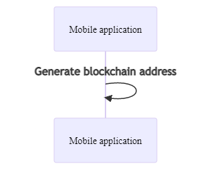

# Creating a user through a mobile application

The mobile app serves as a wallet that stores the NFT token. [The Waves libraries](https://github.com/wavesplatform/waves-transactions) implemented in the app enable operations to be performed directly on the blockchain.

